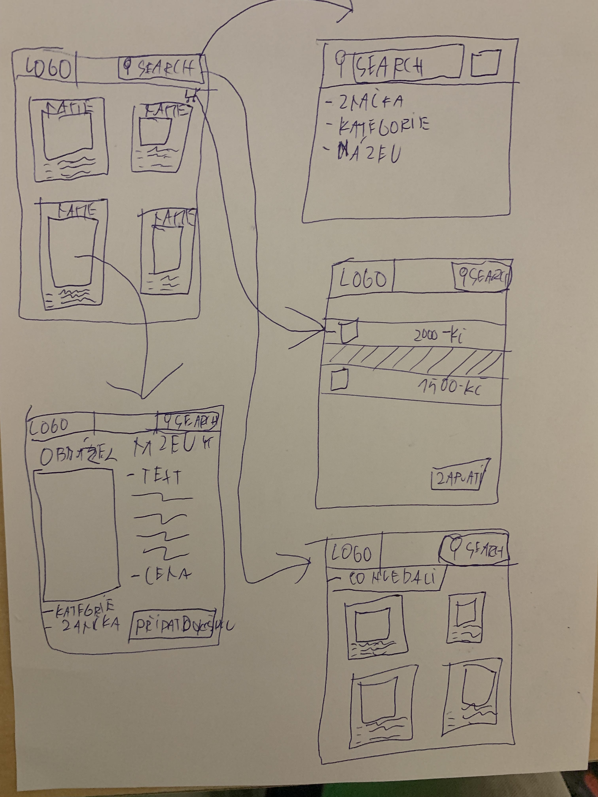

# Obchod s volejbalovím vybavením

*Autor: Vojtěch Vytlačil vojtech.vytlacil.s@gyrab.cz*

Ukázkový ročníkový projekt z předmětu webové technologie ve šk. roce 2024/2025.

## Odborný článek

V administraci se spravuje databáze produktů, každý produkt má název, cenu, popis, kategorii, značku a obrázek. Každý produkt je zařazen do jedné nebo více kategorií (např. míče, obuv, oblečení, doplňky)

Na hlavní stránce je seznam produktů, který je možné filtrovat (dle kategorie a značky) a řadit (dle ceny nebo názvu). Seznam produktů tvoří kartičky, na kterých se zobrazuje obrázek produktu, název, cena a prvních 100 znaků popisu. Kliknutím na kartičku se zobrazí stránka detailu produktu, kde se zobrazují všechny atributy produktu. Z detailu produktu je možné přejít na související kategorii (vede na HP s vyfiltrovanými produkty dané kategorie) nebo značku (vede na stránku produktů od stejné značky).

Stránka detailu produktu zobrazuje všechny informace o produktu a sekci s doporučenými podobnými produkty. Z této stránky lze produkt přidat do košíku.

## Wireframes

